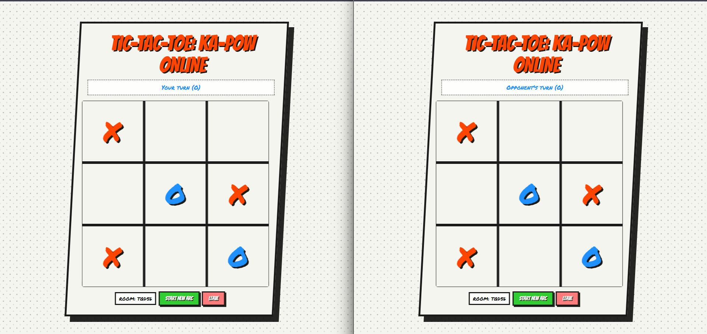
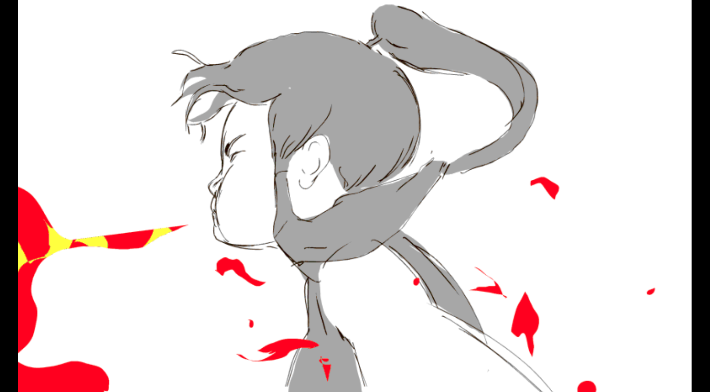
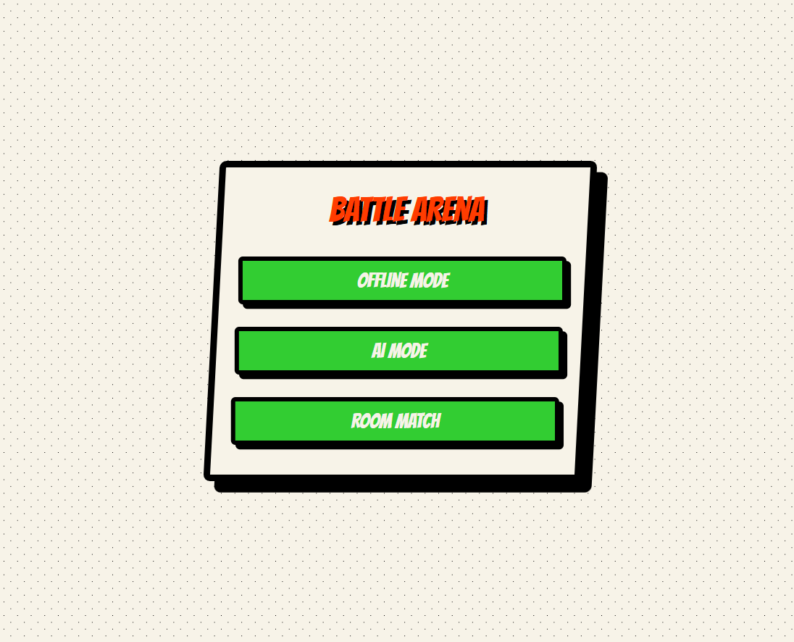
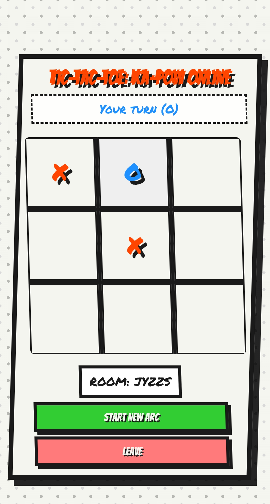

<p align="center">
  
</p>

<h1 align="center">🎮 TIC-TAC-TOE: KA-POW! EDITION</h1>
<p align="center"><strong>A High-Impact Comic-Book Style Tic-Tac-Toe Game (Offline + Online Multiplayer)</strong></p>

<p align="center">
  
  
  
  
  
</p>

---

# 🚀 Test Run Link  
👉 **https://Goondlabalaji.github.io/tic-tac-toe-online/mode.html**

---

# 🎥 Game Preview (GIF)
<p align="center">
  
</p>

---

# 🖼 Screenshots


<!-- MAIN TWO-COLUMN SCREENSHOT LAYOUT -->
<div style="display:flex; justify-content:center; gap:50px; margin-top:20px;">


<table align="center">
<tr>
<td>

<!-- LEFT COLUMN (3 Images) -->
<table align="center">
<tr>
<td>

<!-- LEFT COLUMN (3 Images with names) -->
<p align="center">
  <br>
  <b>Online Gameplay</b><br><br>

  <br align="center">
  <b>Offline Gameplay</b><br><br>

  <br>
  <b>Win Animation</b><br><br>
</p>

</td>
<td>

<!-- RIGHT COLUMN (2 Images with names) -->
<p align="center">

  <br>
  <b>Home Menu</b><br><br>

  <br>
  <b>Mobile UI</b><br><br>

</p>

</td>
</tr>
</table>


</td>
</tr>
</table>


</div>


---

# ✨ Features

## 🧩 Offline Features
- Comic book-style UI  
- Explosive animations  
- Particle effects  
- Sound effects for every move  
- Win animations  
- Bonus fight-scene GIFs  
- No scrollbars  
- Full mobile support  

## 🌐 Online Multiplayer Features
- Create room / join room  
- Auto room code generator  
- Random first-player assignment  
- Live sync using Firebase  
- Win-line sync  
- GIF bonus scene sync  
- Real-time UI updates  

## 🔊 Audio System (Tone.js)
- X and O each have unique sound  
- Win fanfare  
- Draw noise  
- Comic-style floating text  

## 🎨 Pop-Art Comic UI
- Halftone background  
- Thick black comic borders  
- Skewed panels  
- Animated buttons  
- High-contrast shadows  

---

# 🗂 Folder Structure

```bash
project/
│
├── mode.html        
├── offline.html     
├── online.html      
├── ai.html          # optional
│
├── animation/       # GIF or MP4 scenes
│   ├── ani1.mp4
│   ├── ani2.mp4
│   ├── ani3.mp4
│   └── ...
│
├── images/          # Screenshots for README
│   ├── menu.png
│   ├── offline.png
│   ├── win.png
│   ├── online.png
│   ├── mobileui.jpg
│
├── screenshots/
│   ├── banner.png
│   └── gameplay.gif
│
└── scripts/
    └── main.js
